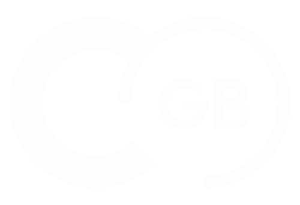
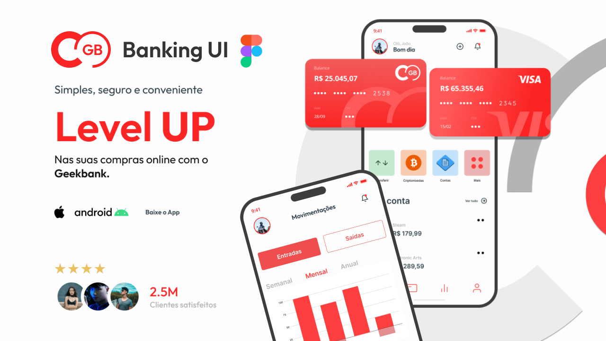
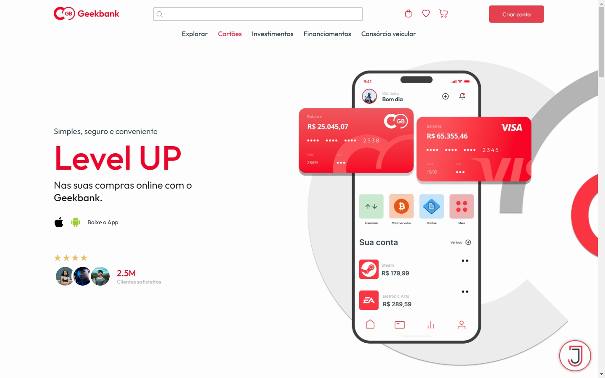
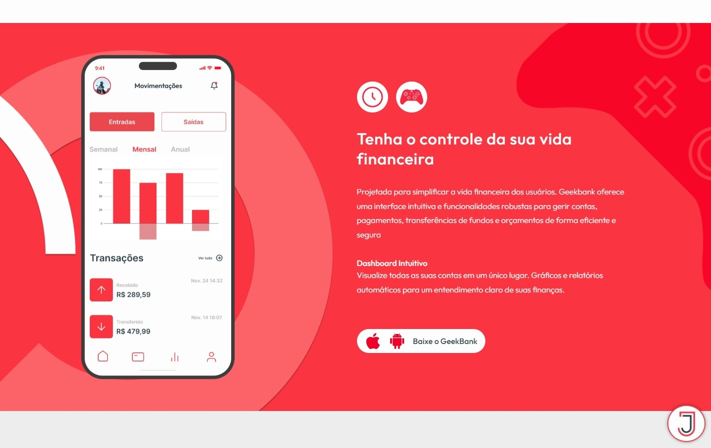

# Geekbank

<div align="left">
  
  
  
  
  
  
  
</div>

###



> Geekbank é um banco digital com foco nas pessoas que vivem o mundo digital do games, oferecendo um controle de gastos e descontos exclusivos na compra de jogos digitais.

## 🚀 Instalando Geekbank

Para instalar o Geekbank:

Windows:

```
git clone https://github.com/Joaommsp/Geekbank.git
```

```
cd Geekbank
```

```
npm i
```

```
npm run dev
```

## ✏️ Protótipo e Design

<p>Confira o design do projeto feito no Figma

<a  href="https://www.figma.com/design/O2P1ADLUshgguYekGdeqBU/Geekbank?node-id=0-1&t=b9ZybBeAtW6KNWUm-1" >
  
</a>

> Clique na imagem para ser encaminhado

## 💻 Um pouco do projeto




## ⭐ Metas

- [x] Uma página viva e elegante
- [x] Design Responsivo
- [x] Deploy no Vercel

## 🔗 Deploy

Clique e acesse o projeto

<div align="left">
  <a href="https://geekbank.vercel.app/"></a>
</div>

## 🤓 Me acompanhe para mais projetos 
